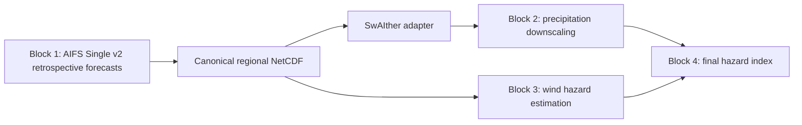

# AITCHazard Mexico

Article-oriented research repository for AI-assisted tropical cyclone hazard forecasting over Mexico.

AITCHazard Mexico is being organized as a reproducible doctoral research workspace for a manuscript on tropical cyclone hazards. The project links retrospective AI weather forecasts, precipitation downscaling, wind hazard estimation, and final hazard index prediction for tropical cyclone cases affecting Mexico and the surrounding region.

The current implementation is smoke-first. It provides a clean repository structure, documented scientific interfaces, tested Block 1 utilities, a synthetic AIFS Single v2 smoke workflow, a SwAIther-compatible adapter, and a shared Apptainer/Curnagl execution plan. Real MARS/AIFS inference and Block 2 model training are intentionally staged as later implementation phases.

## Project Status

| Area | Status | Notes |
|---|---|---|
| Repository organization | Active | Article-ready documentation, package layout, configs, tests, and workflow folders are in place. |
| Block 1 smoke mode | Implemented | Generates a deterministic synthetic NetCDF and derives `tp_6h`, `cp_6h`, and `ws10`. |
| Block 1 real mode | Guarded placeholder | Checks credentials and Anemoi imports, then stops before real MARS retrieval. |
| Block 1 container | Draft implemented | Apptainer definition and Curnagl/UNIL usage notes are available under `containers/`. |
| Block 2 SwAIther adapter | Initial implemented | Converts canonical Block 1 names/dimensions to SwAIther-style low-resolution inputs. |
| Block 2 training/inference | Planned | Design is documented; production training code has not been added yet. |
| Blocks 3 and 4 | Planned | Wind hazard and final hazard index methods remain manuscript/design tasks. |

## Scientific Scope

| Component | Current decision |
|---|---|
| Study region | Mexico and surrounding tropical cyclone influence region |
| Latitude domain | `5N` to `35N` |
| Longitude domain | `130W` to `60W`, stored as `230E` to `300E` in 0-360 convention |
| Study period | Tropical cyclone cases from `2000` to `2025` |
| Forecast model | AIFS Single v2, checkpoint `ecmwf/aifs-single-2.0` |
| Initial states | Planned MARS-based retrospective inputs at `t-6 h` and `t0` |
| Initialization cadence | 6-hourly |
| Forecast horizon | `t0` to `t+72 h` |
| Output cadence | 6-hourly |
| Block 1 target format | Standardized regional NetCDF |
| Main Block 2 predictor | `tp_6h` |
| Optional Block 2 predictor | `cp_6h` |
| Block 2 reference design | SwAIther-Precip adapted from Switzerland to Mexico |
| High-resolution precipitation target | MSWEP-like 6-hour precipitation over Mexico |

## Workflow



## Workflow Blocks

### Block 1: Retrospective AIFS Forecasting

Block 1 generates the meteorological backbone. The production target is retrospective inference with AIFS Single v2 over selected tropical cyclone cases, initialized every 6 hours and stored from `t0` to `t+72 h`.

Current implementation:

- canonical config: `conf/aitchazard_mexico/block1_aifs_single_v2.yaml`;
- smoke runner: `scripts/block1/run_aifs_single_v2.py`;
- synthetic smoke dataset: `src/aitchazard/block1/synthetic.py`;
- NetCDF validation/writing: `src/aitchazard/block1/io.py`;
- derived fields: `tp_6h`, `cp_6h`, and `ws10`;
- guarded real-mode boundary: `src/aitchazard/block1/aifs_runner.py`.

Legacy prototype scripts are preserved under `scripts/block1/legacy/` and documented in `docs/block1-code-audit.md`. They are references, not production entry points.

### Block 2: SwAIther-Style Precipitation Downscaling

Block 2 adapts [SwAIther-Precip](https://github.com/danassou/swaither-precip) to Mexico, AIFS Single v2, tropical cyclone cases, and an MSWEP-like precipitation target.

The documented design follows two stages:

1. Lead-time-aware coarse bias correction.
2. Spatial super-resolution toward a high-resolution precipitation grid.

Current implementation:

- interface sketch: `conf/aitchazard_mexico/block2_swaither_mexico.yaml`;
- variable/dimension contract: `docs/block2-swaither-interface.md`;
- adaptation plan: `docs/swaither-adaptation.md`;
- adapter code: `src/aitchazard/block1/swaither_adapter.py`;
- adapter CLI: `scripts/block1/prepare_swaither_inputs.py`.

The adapter writes SwAIther-compatible variables and dimensions while keeping canonical Block 1 names in the source NetCDF.

### Block 3: Wind Hazard Estimation

Block 3 will estimate wind hazard from Block 1 meteorological fields and tropical cyclone structure information. Candidate inputs include 10 m winds, pressure fields, atmospheric vertical structure, and storm geometry.

This block is not implemented yet. Its final predictors, probabilistic formulation, and validation metrics remain open.

### Block 4: Hazard Index Prediction

Block 4 will combine precipitation and wind hazard information into a final tropical cyclone hazard index for the study region.

This block is not implemented yet. The index definition, calibration strategy, and impact-oriented validation plan remain open.

## Repository Layout

```text
conf/        Canonical YAML configuration files for Block 1 and Block 2 interfaces.
containers/ Apptainer definition and shared Curnagl/UNIL execution notes.
data/        Local data staging area; large contents are ignored by Git.
docs/        Project context, methodology, schemas, governance, and adaptation notes.
notebooks/   Future exploratory notebooks; outputs should remain lightweight.
outputs/     Local generated outputs; large/regenerable products are ignored by Git.
paper/       Manuscript outline and publication figure workspace.
scripts/     Command-line entry points and legacy Block 1 prototypes.
src/         Importable `aitchazard` Python package.
tests/       Unit and smoke tests for implemented utilities.
workflows/   SLURM templates and workflow documentation.
```

## Quick Start

Clone the repository:

```bash
git clone https://github.com/apereze/AITCHazard_Mexico.git
cd AITCHazard_Mexico
```

Create the lightweight development environment:

```bash
conda env create -f environment.yml
conda activate aitchazard-mexico
```

For SwAIther-oriented development:

```bash
conda env create -f environment-swaither.yml
conda activate aitchazard-swaither
```

## Run the Current Smoke Workflow

Smoke mode uses synthetic data. It does not require GPU, MARS, network access, or credentials.

Generate the canonical Block 1 smoke NetCDF:

```bash
python scripts/block1/run_aifs_single_v2.py \
  --config conf/aitchazard_mexico/block1_aifs_single_v2.yaml \
  --mode smoke
```

Convert the smoke output to the SwAIther-compatible interface:

```bash
python scripts/block1/prepare_swaither_inputs.py \
  --input outputs/block1_smoke.nc \
  --output outputs/swaither_inputs_smoke.nc
```

Expected local outputs:

- `outputs/block1_smoke.nc`
- `outputs/swaither_inputs_smoke.nc`

These files are generated products and should not be committed.

## Container and Curnagl/UNIL Execution

The shared container is defined in:

- `containers/aitchazard_aifs.def`
- `containers/README.md`

Build with Apptainer/Singularity from the repository root:

```bash
module load gcc cuda apptainer
apptainer build aitchazard_aifs.sif containers/aitchazard_aifs.def
```

Run tests and smoke mode inside the container:

```bash
export AITCHAZARD_REPO=/users/$USER/AITCHazard_Mexico
export AITCHAZARD_CONTAINER=/work/$USER/containers/aitchazard_aifs.sif

apptainer exec --nv \
  -B /users,/scratch,/work \
  -B "$AITCHAZARD_REPO:/ws" \
  "$AITCHAZARD_CONTAINER" \
  bash -lc "cd /ws && python -m pytest && python scripts/block1/run_aifs_single_v2.py --config conf/aitchazard_mexico/block1_aifs_single_v2.yaml --mode smoke"
```

SLURM templates:

- `workflows/slurm/aifs_single_v2_smoke.slurm`
- `workflows/slurm/aifs_single_v2_real.slurm`

Required variables for the templates:

- `AITCHAZARD_REPO`
- `AITCHAZARD_CONTAINER`

Mode-specific variables:

- `AITCHAZARD_OUTPUT_DIR`
- `AITCHAZARD_CONFIG`
- `AITCHAZARD_CREDENTIALS_DIR`

## Credentials

Credentials are never stored in the repository and never baked into the container.

Safe credential handles may be provided by read-only mounts or environment variables:

- `.ecmwfapirc`
- `.cdsapirc`
- `.netrc`
- `~/.config/earthkit/`
- `ECMWF_API_URL`
- `ECMWF_API_KEY`
- `ECMWF_API_EMAIL`
- `CDSAPI_URL`
- `CDSAPI_KEY`
- `HF_TOKEN`

Check credential presence without printing secret values:

```bash
python scripts/check_credentials.py --profile mars
```

For real mode, `HF_TOKEN` alone is not enough. A MARS/ECMWF/CDS credential handle is required before the real-mode boundary will continue.

## Tests and Validation

Run the test suite:

```bash
python -m pytest
```

Current test coverage includes:

- Block 1 constants and Mexico domain conventions;
- `tp_6h` and `cp_6h` interval precipitation derivation;
- `ws10` derivation from `10u` and `10v`;
- Block 1 YAML validation for AIFS Single v2, lead times, and domain;
- synthetic smoke dataset generation;
- SwAIther-compatible variable and dimension mapping;
- CLI smoke output writing and adapter conversion;
- credential handle detection and redaction behavior.

The container `%test` checks imports for `torch`, `anemoi`, `earthkit`, `xarray`, `physicsnemo`, and `aitchazard`.

## Data Governance

Large raw datasets and generated scientific outputs should not be committed to this repository.

Do not commit:

- NetCDF files (`*.nc`, `*.nc4`, `*.cdf`);
- GRIB files (`*.grib`, `*.grib2`);
- Zarr stores (`*.zarr/`);
- model checkpoints and weights;
- large rasters or temporary HPC outputs;
- credentials, API tokens, `.env` files, or private local documents.

Use `data/` for local staging and `outputs/` for regenerable outputs. Document provenance and regeneration steps instead of storing large products in Git.

See `docs/data-governance.md` for the detailed policy.

## Documentation Map

| File | Purpose |
|---|---|
| `docs/project-context.md` | Cleaned project context and current scientific decisions. |
| `docs/methodology.md` | Manuscript-facing four-block methodology draft. |
| `docs/block1-code-audit.md` | Audit of legacy Block 1 prototype scripts. |
| `docs/block1-netcdf-schema.md` | Preliminary Block 1 NetCDF schema and derived variables. |
| `docs/aifs-single-v2-execution.md` | Smoke mode, container, credentials, and real-mode guard notes. |
| `docs/swaither-adaptation.md` | SwAIther-Precip adaptation plan for Mexico. |
| `docs/block2-swaither-interface.md` | Block 2 variable and dimension contract. |
| `docs/data-governance.md` | Data, output, and credential governance rules. |
| `paper/outline.md` | Working article outline. |
| `docs/references.bib` | Bibliographic references for manuscript development. |

## External References

- [ECMWF AIFS Machine Learning data](https://www.ecmwf.int/en/forecasts/dataset/aifs-machine-learning-data)
- [AIFS Single v2 implementation notes](https://confluence.ecmwf.int/display/FCST/Implementation%2Bof%2BAIFS%2BSingle%2Bv2)
- [AIFS Single v2 checkpoint on Hugging Face](https://huggingface.co/ecmwf/aifs-single-2.0)
- [SwAIther-Precip upstream repository](https://github.com/danassou/swaither-precip)

## Development Roadmap

Near-term priorities:

1. Build and smoke-test the Apptainer image on Curnagl/UNIL.
2. Implement the MARS input-state builder for `t-6 h` and `t0`.
3. Add real-mode Block 1 integration tests once credentials and permissions are available.
4. Finalize Block 1 NetCDF naming, compression, chunking, and metadata conventions.
5. Implement the MSWEP-like target preprocessing workflow for Block 2.
6. Decide whether SwAIther code will remain external, become a fork, or be selectively vendored with license notices.
7. Define Block 3 wind hazard predictors and validation metrics.
8. Define the final Block 4 hazard index formulation.

## Contributors

- Adolfo Perez Estrada, Universidad Nacional Autonoma de Mexico / University of Lausanne.
- Milton Gomez, University of Lausanne.
- Christian Dominguez, Universidad Nacional Autonoma de Mexico.
- Tom Beucler, University of Lausanne.

## License

This project is licensed under the MIT License. See `LICENSE.md`.

If upstream SwAIther-Precip code is copied or vendored in a later phase, preserve the upstream Apache-2.0 license notices and attribution requirements.
