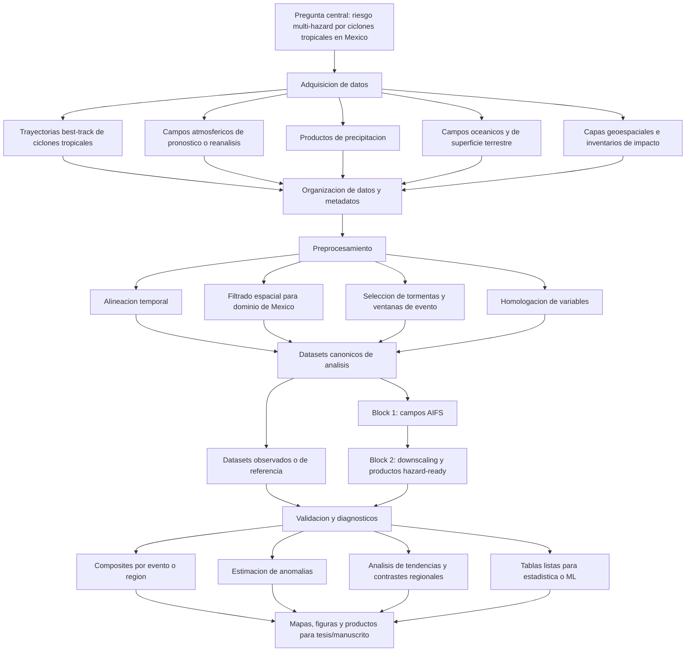
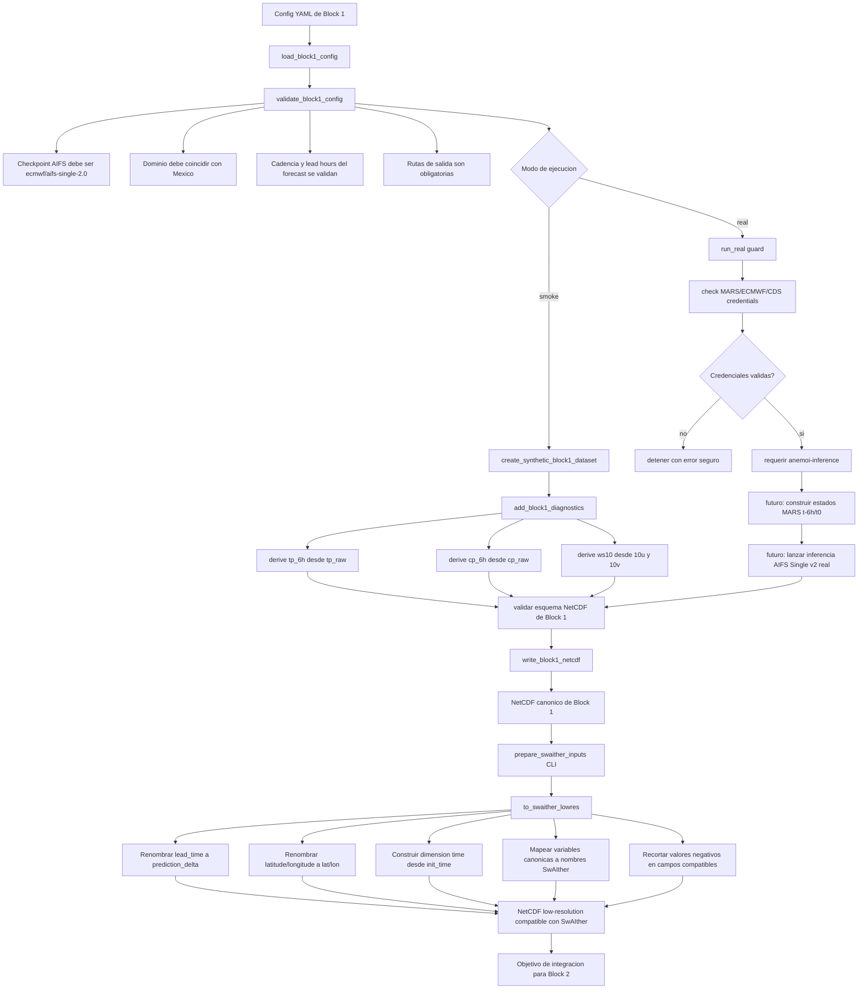
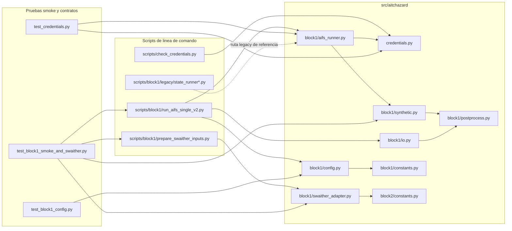

# Bosquejo del workflow y pipeline de AITCHazard Mexico

Version: v0, bosquejo de trabajo

Este documento resume el workflow general de investigacion, el pipeline implementado alrededor de Block 1 y el puente hacia entradas compatibles con SwAIther. Tambien sirve como mapa inicial para ubicar avances, brechas y paquetes de trabajo futuros.

El bosquejo esta basado en el estado actual del repositorio, el README y contratos recuperables desde artefactos Python compilados. En el arbol visible faltan varios archivos fuente `.py` y configuraciones YAML, asi que este documento debe tratarse como un mapa vivo que podremos refinar cuando esos archivos se restauren.

## 1. Workflow general de investigacion



## 2. Pipeline implementado actualmente

El flujo concreto que ya se alcanza a mapear esta centrado en Block 1 y en la preparacion de entradas de baja resolucion compatibles con SwAIther.



## 3. Mapa por modulo



## 4. Avances actuales

| Area | Estado actual | Por que importa |
| --- | --- | --- |
| Marco del repositorio | El README define etapas de datos, preprocesamiento, filtrado espacial, composites, anomalias, tendencias, visualizacion y productos ML-ready. | Da una estructura reproducible al proyecto. |
| Credenciales | Existe una revision segura de credenciales por archivos y variables de entorno sin imprimir secretos. | Es requisito antes de correr AIFS/MARS en modo real. |
| Contrato de config Block 1 | La validacion espera AIFS Single v2, dominio Mexico, cadencia del forecast, lead hours y rutas de salida. | Evita corridas con modelo, dominio o supuestos incorrectos. |
| Modo smoke | Se puede generar un dataset sintetico deterministico de Block 1 sin credenciales. | Permite pruebas locales antes de tener acceso completo a HPC/datos. |
| Diagnosticos | El contrato incluye precipitacion por intervalo y viento a 10 m. | Produce variables relevantes para hazards y modelos posteriores. |
| I/O NetCDF | Hay validacion minima del esquema canonico antes de escribir salidas. | Protege los adaptadores downstream de datasets mal formados. |
| Adaptador SwAIther | Las variables canonicas de Block 1 se mapean a nombres y dimensiones esperadas por SwAIther. | Construye el puente de AIFS a downscaling de precipitacion. |
| Constantes Block 2 | Se codifican repo/commit de referencia SwAIther, variables de entrada, target, invariantes y salidas esperadas. | Define el contrato de integracion futura. |
| Pruebas | Los artefactos compilados muestran pruebas para config, credenciales, smoke dataset, contrato del adaptador y CLI smoke. | Indica un diseno testeable, aunque falta restaurar fuentes visibles. |
| Runners legacy | Hay referencias a IBTrACS, Anemoi runner, object storage y variantes ERA5/MARS/CDF. | Sirven como guia para migrar la orquestacion de modo real. |

## 5. Contratos clave

### Block 1 canonico

Coordenadas esperadas:

- `init_time`
- `lead_time`
- `valid_time`
- `latitude`
- `longitude`

Variables importantes:

- Campos crudos o de superficie: `tp_raw`, `cp_raw`, `10u`, `10v`, `msl`, `skt`, `sst`, `tcw`
- Diagnosticos derivados: `tp_6h`, `cp_6h`, `ws10`
- Variables sinteticas inferidas para compatibilidad SwAIther: `q_500`, `q_850`, `t_500`, `t_850`, `z_500`, `z_850`

### Entrada low-resolution estilo SwAIther

Contrato de dimensiones:

- `time`
- `prediction_delta`
- `lat`
- `lon`

Contrato de mapeo de variables:

| Block 1 canonico | Nombre estilo SwAIther |
| --- | --- |
| `tp_6h` | `total_precipitation_NoNeg` |
| `cp_6h` | `convective_precipitation_NoNeg` |
| `10u` | `wind_10m_u` |
| `10v` | `wind_10m_v` |
| `q_500` | `specific_humidity_500hPa` |
| `q_850` | `specific_humidity_850hPa` |
| `t_500` | `temperature_500hPa` |
| `t_850` | `temperature_850hPa` |
| `z_500` | `geopotential_500hPa` |
| `z_850` | `geopotential_850hPa` |

Salidas esperadas de Block 2:

- `bias_corrected_coarse`
- `high_resolution_precipitation`

## 6. Mapa de trabajo futuro

```mermaid
flowchart TD
    A[Pipeline v0 actual] --> B[Recuperacion e higiene del repositorio]
    B --> B1[Restaurar archivos fuente .py]
    B --> B2[Restaurar conf/aitchazard_mexico/block1_aifs_single_v2.yaml]
    B --> B3[Agregar requirements o environment file]
    B --> B4[Retirar __pycache__ versionados si se recupera el fuente]

    A --> C[Block 1 modo real]
    C --> C1[Definir convencion de montaje de credenciales MARS/ECMWF/CDS]
    C --> C2[Construir retrieval de estados t-6h/t0]
    C --> C3[Containerizar runtime anemoi-inference]
    C --> C4[Correr AIFS Single v2 sobre fechas TC seleccionadas]
    C --> C5[Guardar metadatos de procedencia por corrida]

    A --> D[Block 2 downscaling]
    D --> D1[Traer o fijar referencia SwAIther en commit definido]
    D --> D2[Validar contrato de variables/dimensiones low-resolution]
    D --> D3[Agregar invariantes como altitude]
    D --> D4[Correr bias correction y precipitacion de alta resolucion]
    D --> D5[Empaquetar salidas Block 2 como productos hazard-ready]

    A --> E[Productos de analisis]
    E --> E1[Composites por ciclon/evento]
    E --> E2[Diagnosticos de precipitacion extrema]
    E --> E3[Cruces con exposicion a inundaciones y deslizamientos]
    E --> E4[Workflow de anomalias y tendencias]
    E --> E5[Figuras de calidad publicacion]

    A --> F[Validacion y automatizacion]
    F --> F1[Recuperar y correr pytest]
    F --> F2[Agregar fixtures smoke livianas]
    F --> F3[Agregar CI para contratos de config y adaptador]
    F --> F4[Agregar manifests de corrida y checksums]
```



## 7. Hitos sugeridos de corto plazo

1. Restaurar fuentes y configs visibles.

   Los artefactos compilados indican que existian modulos fuente para `credentials`, `block1`, `block2`, scripts y tests. El arbol visible actual no contiene los `.py` y YAML necesarios para desarrollo normal.

2. Hacer que el smoke path corra desde un checkout limpio.

   Meta minima:

   ```bash
   python scripts/block1/run_aifs_single_v2.py --config conf/aitchazard_mexico/block1_aifs_single_v2.yaml --mode smoke
   python scripts/block1/prepare_swaither_inputs.py --input outputs/block1_smoke.nc --output outputs/swaither_inputs_smoke.nc
   ```

3. Congelar el esquema canonico NetCDF de Block 1.

   Documentar coordenadas, variables, unidades, convenciones de acumulacion, dominio espacial, cadencia de lead time y metadatos obligatorios.

4. Implementar el constructor de estados de entrada para AIFS real.

   El modo real actual se detiene intencionalmente antes de lanzar inferencia. El siguiente paso tecnico es construir los estados MARS t-6h/t0 e integrar el runtime Anemoi.

5. Conectar Block 2 primero como adaptador probado y despues como corrida de modelo.

   Primero conviene validar el NetCDF low-resolution contra el contrato de SwAIther. Despues se agregan invariantes y se ejecuta el modelo de downscaling.

6. Promover los productos hazard-ready hacia workflows de analisis.

   Cuando exista precipitacion de alta resolucion, conectarla con composites de eventos, anomalias, overlays de inundaciones/deslizamientos y figuras para publicacion.

## 8. Preguntas abiertas

- Cual es el dominio Mexico autoritativo para todas las etapas: limites geograficos, mascaras por cuenca o ventanas relativas a tormenta?
- Las fechas de Block 1 deben venir de filtros IBTrACS por landfall/evento, listas manuales de casos o ambos?
- Que producto de precipitacion se usara como referencia para validacion y bias correction?
- Que salida de Block 2 sera el dataset hazard-ready oficial: precipitacion coarse corregida, precipitacion de alta resolucion o ambas?
- Donde viviran los datos crudos e intermedios grandes: archivo externo, scratch HPC, object storage o scripts reproducibles de descarga?
- Que metadatos deben acompanar cada corrida para reproducibilidad de tesis/manuscrito?
